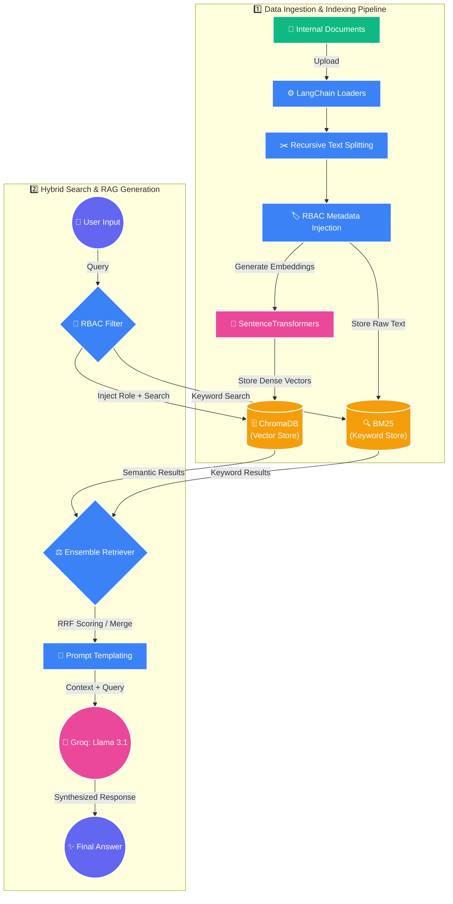

# Enterprise RAG Copilot - Architecture Infographic

The following diagram illustrates the complete end-to-end data flow for both the **Document Ingestion** phase and the **Hybrid Search Retrieval** phase of the Enterprise Knowledge Copilot.

### Key Highlights
* **Dual Indexing:** Notice how every document goes into **two separate databases** (ChromaDB for "meaning" and BM25 for "exact keywords").
* **Early RBAC Filtering:** The `RBAC Filter` step happens *before* the vector database retrieves the context. This prevents the system from accidentally surfacing restricted data into the memory of the LLM. 
* **Ensemble Fusion:** The `Ensemble Retriever` takes the outputs from both the vector data and keyword data, applying *Reciprocal Rank Fusion (RRF)* to mathematically select the best combination of results.
